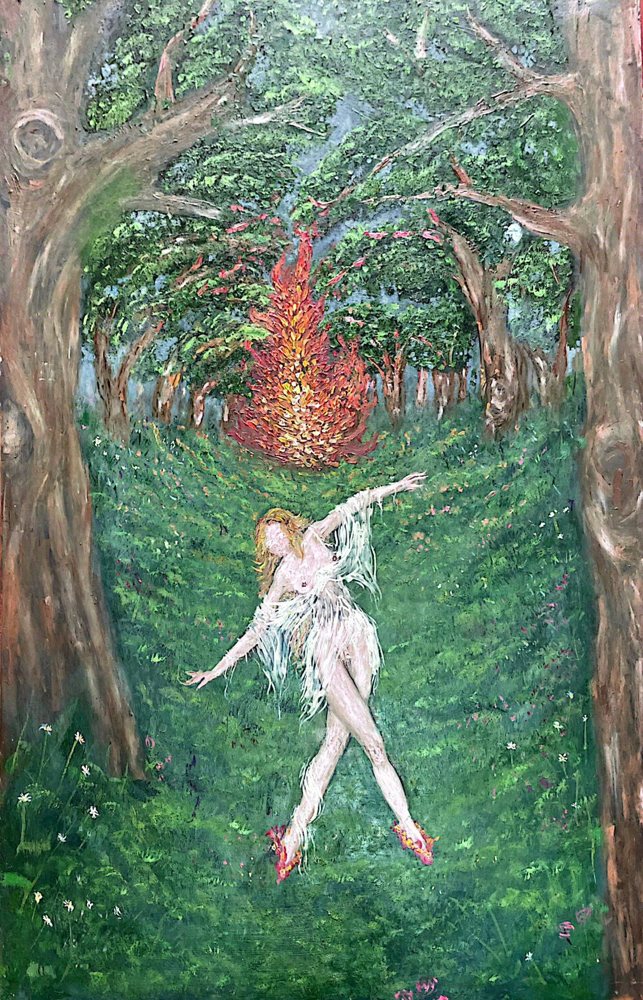
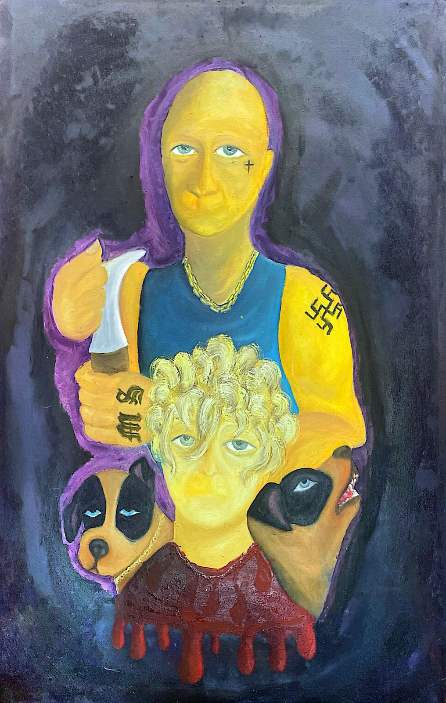
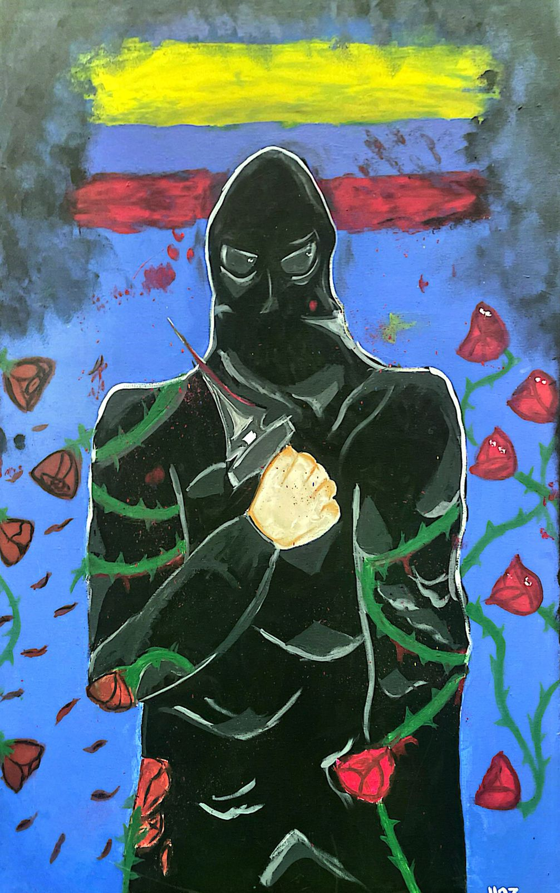
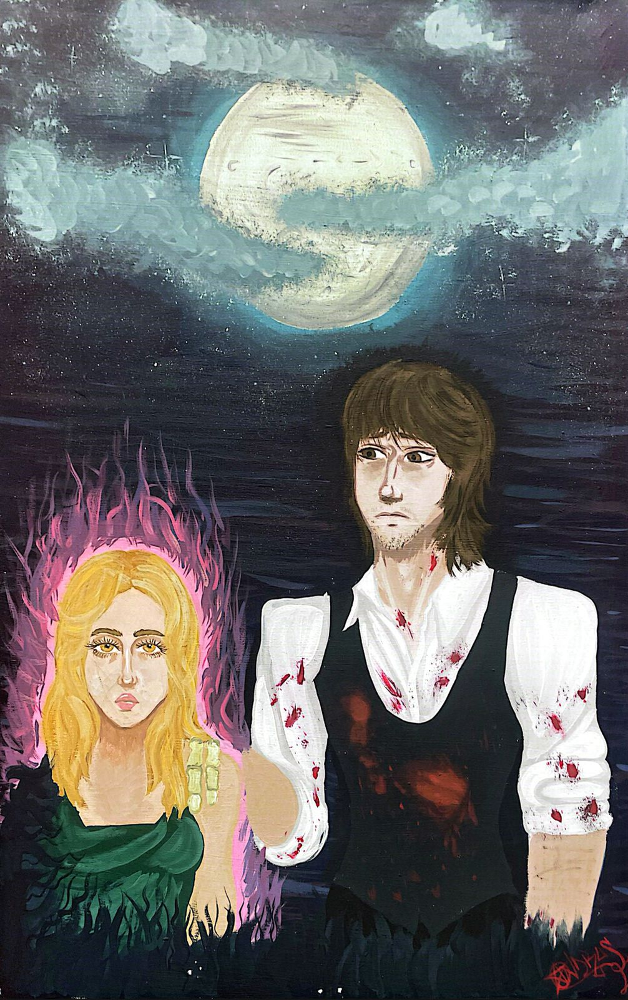
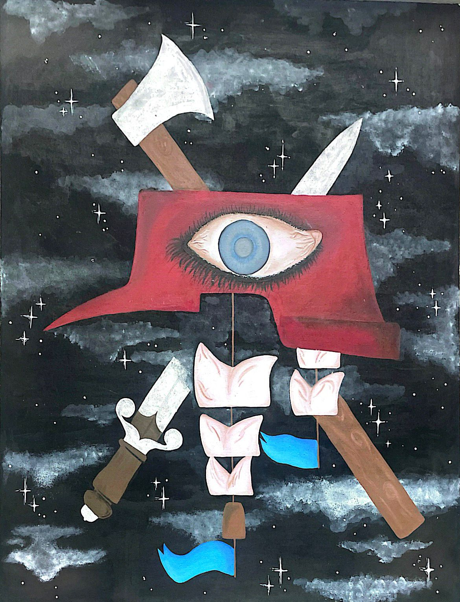

<html lang="es">
<head>
  <meta charset="UTF-8" />
  <meta name="viewport" content="width=device-width, initial-scale=1.0" />
  <title>Votación de Cuadros</title>
  <link rel="shortcut icon" type="image/x-icon" href="favicon.ico">
  
</head>
<body>
  

    <h1>Votación</h1>
    

      Selecciona tu cuadro favorito y emite tu voto.
      <b>Solo puedes votar una vez.</b>
    

    

      

        
        

          <h3>Nombre</h3>
          
Curso: 1101

          
Descripción

          

            <button class="vote-button" data-cuadro-id="1">Votar</button>
            0 votos
          

        

      

      

        
        

          <h3>Nombre</h3>
          
Curso: 

          
Descripción

          

            <button class="vote-button" data-cuadro-id="2">Votar</button>
            0 votos
          

        

      

      

        
        

          <h3>Nombre</h3>
          
Curso: 

          
Descripción

          

            <button class="vote-button" data-cuadro-id="3">Votar</button>
            0 votos
          

        

      

      

        
        

          <h3>Nombre</h3>
          
Curso: 

          
Descripción

          

            <button class="vote-button" data-cuadro-id="4">Votar</button>
            0 votos
          

        

      

      

        
        

          <h3>Nombre</h3>
          
Curso: 

          
Descripción

          

            <button class="vote-button" data-cuadro-id="5">Votar</button>
            0 votos
          

        

      

    

  

  <!-- Modal -->
  

    &times;
    

      
      

    

  

  <!-- Firebase SDK -->
  
  
  
</body>
</html>
